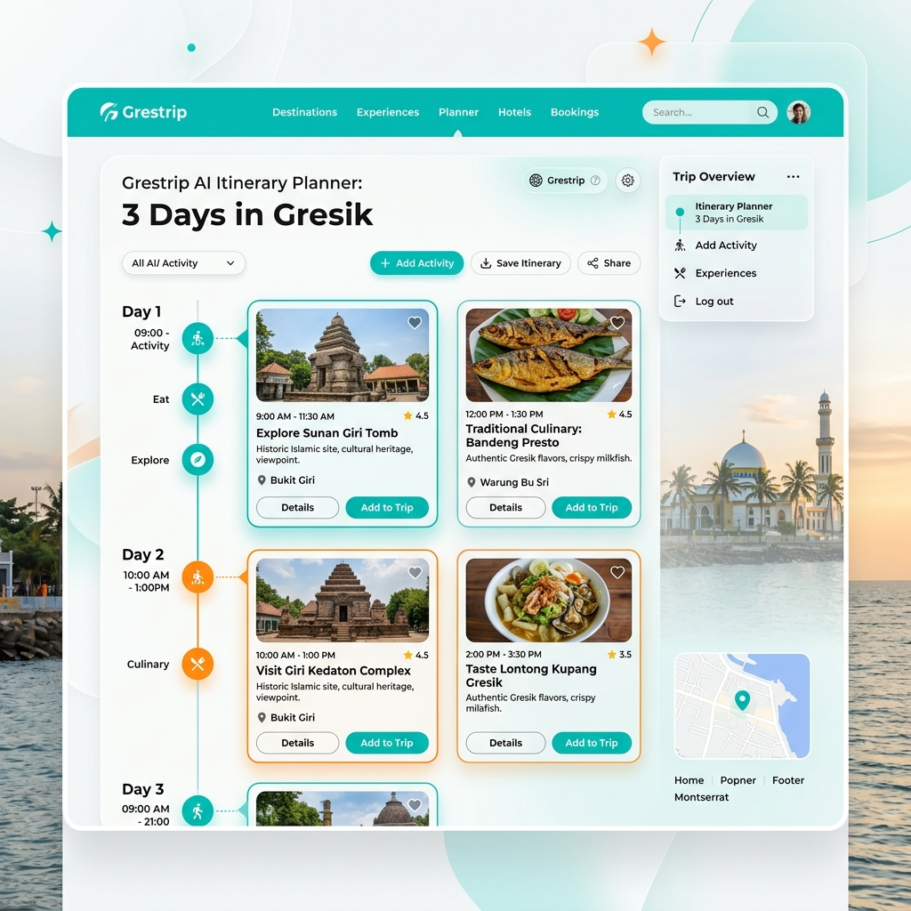
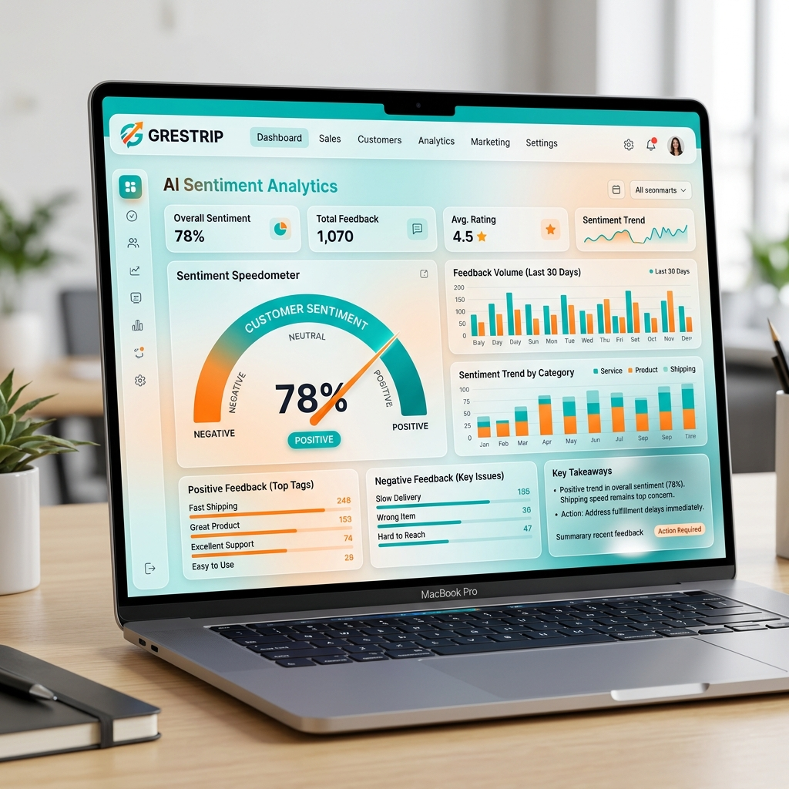
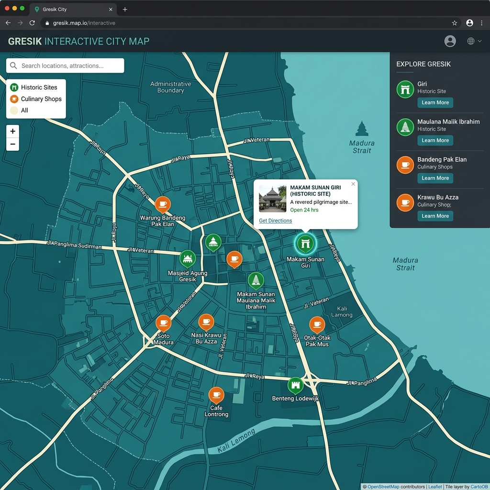
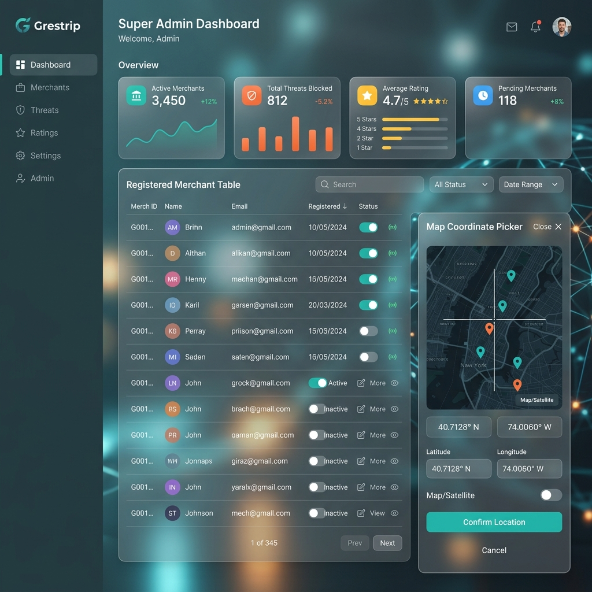
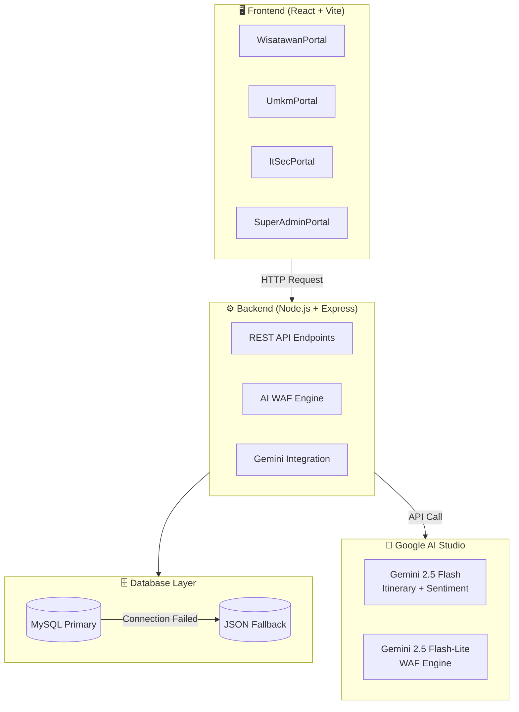

# 📋 LAPORAN EVALUASI & INSTRUKSI PERBAIKAN
## Grestrip Smart & Secure Navigator — #JuaraVibeCoding 2026
**Dievaluasi oleh:** Claude Sonnet (Anthropic) | **Tanggal:** Mei 2026 | **Versi Proyek:** 1.0.0

---

## 🎯 RINGKASAN EVALUASI

| Aspek | Skor | Catatan |
|---|---|---|
| Konsep & Diferensiasi | 10/10 | Unik, lokal, berimpact |
| Fitur AI | 9/10 | 3 use case Gemini yang berbeda |
| Kompleksitas Teknis | 9/10 | 28 CRUD, 4 portal, dual-DB |
| Keamanan | 9/10 | AES-256 + dual-layer WAF |
| Kesiapan Kompetisi | 5/10 | ⚠️ Belum deploy, belum ada demo visual |
| **TOTAL** | **8.4/10** | Proyek sangat kuat, butuh finishing |

---

## 🔴 PERBAIKAN PRIORITAS TINGGI (Wajib Sebelum Submit)

### [FIX-01] Tambahkan Live Demo URL ke README

**Masalah:** README tidak memiliki link live demo. Juri kompetisi **tidak akan menjalankan proyek lokal** — mereka butuh bisa klik dan lihat langsung.

**Yang Harus Dilakukan:**
1. Deploy backend ke **Railway** atau **Render** (gratis, support Node.js + environment variables)
2. Deploy frontend React (hasil `npm run build`) ke **Vercel** atau **Netlify**
3. Set semua environment variables di dashboard platform hosting:
   - `GEMINI_API_KEY`
   - `ENCRYPTION_KEY`
   - `PORT`
4. Tambahkan badge dan link di bagian atas README, tepat di bawah judul proyek:

```markdown
[](https://URL_DEMO_KAMU_DI_SINI)
```

---

### [FIX-02] Tambahkan Screenshot UI ke README

**Masalah:** README sepanjang 236 baris tidak memiliki satu pun gambar UI. Ini membuat proyek terlihat tidak menarik secara visual di GitHub, padahal UI-nya sudah bagus.

**Yang Harus Dilakukan:**
Ambil screenshot dari 5 halaman berikut, upload ke folder `docs/screenshots/` di repo, lalu tambahkan ke README di bawah bagian "Fitur Utama":

```markdown
## 📸 Tampilan Antarmuka

### Portal Wisatawan — AI Itinerary Planner


### Portal UMKM — Sentiment Analytics


### IT Security — WAF Monitoring Console


### Peta Interaktif Gresik


### Portal Super Admin

```

---

### [FIX-03] Tambahkan Video Demo (Sangat Direkomendasikan)

**Masalah:** Fitur WAF + AI Itinerary adalah fitur yang paling impressive tapi tidak bisa terlihat dari screenshot statis.

**Yang Harus Dilakukan:**
1. Rekam demo video 2-3 menit menggunakan OBS atau Loom
2. Tunjukkan alur: Login → Generate Itinerary AI → Test WAF di playground → Lihat sentiment UMKM
3. Upload ke YouTube (unlisted) atau Loom
4. Tambahkan di README:

```markdown
## 🎬 Demo Video

[](https://URL_VIDEO_KAMU)
```

---

## 🟡 PERBAIKAN PRIORITAS SEDANG (Meningkatkan Nilai Teknis)

### [FIX-04] Perbaiki Dev Script di package.json

**Masalah:** `package.json` di root menggunakan `node server.js` untuk dev script, padahal `nodemon` sudah terdaftar sebagai dependency di task breakdown (S0-10 ✅) namun tidak diterapkan di script.

**File:** `/package.json`

**Perubahan:**
```json
// SEBELUM:
"scripts": {
  "start": "node server.js",
  "dev": "node server.js"
}

// SESUDAH:
"scripts": {
  "start": "node server.js",
  "dev": "nodemon server.js"
}
```

**Tambahkan nodemon ke devDependencies:**
```bash
npm install --save-dev nodemon
```

---

### [FIX-05] Tambahkan Peringatan Keamanan API Key di README

**Masalah:** Fitur input Gemini API Key langsung dari sidebar UI adalah fitur bagus untuk demo, namun berpotensi berbahaya jika pengguna salah paham cara kerjanya. Harus ada disclaimer jelas.

**Yang Harus Dilakukan:**
Tambahkan blok peringatan ini di bagian "Mode Simulasi vs Real API" di README:

```markdown
> [!WARNING]
> **Peringatan Keamanan API Key:**
> Input API Key via sidebar hanya direkomendasikan untuk **demo lokal** atau **testing pribadi**.
> API Key yang dimasukkan dikirim ke backend server dalam request body dan **tidak pernah disimpan** 
> di database atau log. Jangan gunakan API Key production di environment publik yang tidak terenkripsi HTTPS.
```

---

### [FIX-06] Tambahkan Akun Demo di README

**Masalah:** README tidak mencantumkan kredensial akun demo. Juri atau penguji tidak tahu cara login ke 4 portal berbeda.

**Yang Harus Dilakukan:**
Tambahkan tabel ini di bagian Panduan Instalasi:

```markdown
## 🔑 Akun Demo (Default Seed Data)

| Role | Email | Password | Akses |
|---|---|---|---|
| Wisatawan | `wisatawan@demo.com` | `demo123` | Portal Wisatawan |
| UMKM | `umkm@demo.com` | `demo123` | Portal UMKM |
| IT Security | `itsec@demo.com` | `demo123` | Portal IT Security |
| Super Admin | `admin@demo.com` | `demo123` | Portal Super Admin |

> Akun di atas tersedia otomatis dari seed data `database.json`.
```

*(Sesuaikan email dan password dengan data aktual di `data/database.json`)*

---

### [FIX-07] Tambahkan Penjelasan Arsitektur Sistem

**Masalah:** README menjelaskan fitur dengan sangat baik, tapi tidak ada diagram arsitektur sistem. Untuk kompetisi teknis, ini poin penting bagi juri yang menilai aspek engineering.

**Yang Harus Dilakukan:**
Tambahkan diagram Mermaid di README (GitHub render otomatis):

````markdown
## 🏗️ Arsitektur Sistem


````

---

## 🟢 PERBAIKAN PRIORITAS RENDAH (Nilai Tambah / Bonus)

### [FIX-08] Tambahkan Basic Unit Test

**Masalah:** Tidak ada testing sama sekali di proyek. Untuk kompetisi dengan penilaian kualitas kode, ini bisa mengurangi poin.

**Yang Harus Dilakukan:**
Buat minimal 3 test case untuk WAF engine karena ini adalah fitur paling kritis:

**File baru:** `tests/waf.test.js`

```javascript
// Install: npm install --save-dev jest
const { scanHeuristics } = require('../waf');

describe('WAF Heuristic Engine', () => {
  test('mendeteksi XSS payload', () => {
    const result = scanHeuristics('<script>alert("xss")</script>');
    expect(result.isBlocked).toBe(true);
    expect(result.type).toBe('Stored XSS');
  });

  test('mendeteksi SQL Injection', () => {
    const result = scanHeuristics("' OR '1'='1");
    expect(result.isBlocked).toBe(true);
    expect(result.type).toBe('SQL Injection');
  });

  test('meloloskan ulasan bersih', () => {
    const result = scanHeuristics('Tempatnya sangat bagus dan bersih!');
    expect(result.isBlocked).toBe(false);
    expect(result.type).toBe('Clean Traffic');
  });
});
```

**Tambahkan script ke package.json:**
```json
"scripts": {
  "test": "jest tests/"
}
```

---

### [FIX-09] Tambahkan CONTRIBUTING.md

**Masalah:** Proyek tidak memiliki panduan kontribusi. Ini minor untuk kompetisi tapi menunjukkan kematangan proyek.

**File baru:** `CONTRIBUTING.md` (buat file singkat 20-30 baris berisi: cara setup lokal, coding conventions, cara submit PR)

---

### [FIX-10] Tambahkan LICENSE File

**Masalah:** README mencantumkan badge `MIT License` tapi file `LICENSE` tidak ada di repo.

**Yang Harus Dilakukan:**
Buat file `LICENSE` di root dengan teks MIT License standar, atau generate via GitHub (Add file → Create new file → ketik `LICENSE` → pilih MIT template).

---

## ✅ CHECKLIST FINAL SEBELUM SUBMIT

Centang semua ini sebelum mengumpulkan ke event:

- [ ] `[FIX-01]` Live demo URL berjalan tanpa error
- [ ] `[FIX-01]` Badge live demo ada di README
- [ ] `[FIX-02]` Minimal 4 screenshot UI ada di README
- [ ] `[FIX-03]` Link video demo tersedia
- [ ] `[FIX-04]` Dev script menggunakan nodemon
- [ ] `[FIX-05]` Disclaimer API Key ada di README
- [ ] `[FIX-06]` Akun demo terdokumentasi di README
- [ ] `[FIX-07]` Diagram arsitektur ada di README
- [ ] `[FIX-08]` Minimal 3 unit test WAF berjalan (`npm test`)
- [ ] `[FIX-09]` File `LICENSE` ada di repo
- [ ] Semua 4 portal bisa diakses dari live demo
- [ ] Mode simulasi berjalan tanpa Gemini API Key
- [ ] README terbaca baik di mobile GitHub

---

## 💡 CATATAN UNTUK AGENT

Saat mengerjakan perbaikan di atas, perhatikan constraint yang sudah ada di `agents/agents.md`:

- **JANGAN** mengubah logic portal yang sudah berjalan (WisatawanPortal, UmkmPortal, ItSecPortal, SuperAdminPortal)
- **JANGAN** menghapus fitur Mode Simulasi
- **SELALU** gunakan design token yang sudah ada: `primary: #006666`, `secondary: #e05624`
- **SELALU** test Mode Simulasi setelah setiap perubahan backend
- Font minimum `text-[10px]` — tidak boleh lebih kecil
- Tidak ada `alert()` atau `confirm()` native

Fokus utama: **FIX-01 sampai FIX-03** adalah yang paling berdampak untuk kompetisi. Kerjakan dalam urutan prioritas.

---

*Laporan ini dibuat berdasarkan review kode repositori `github.com/Dwinur01/getrips` pada Mei 2026.*
