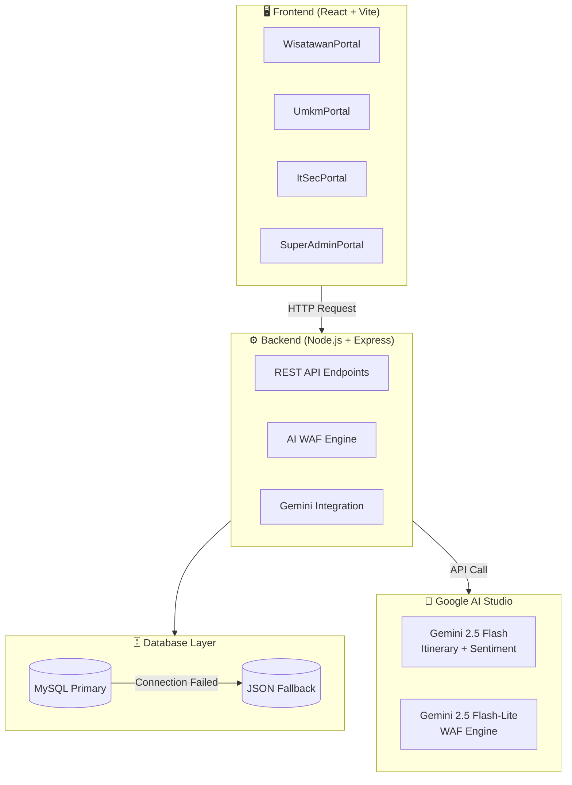

# 🗺️ Grestrip Smart & Secure Navigator
### *Platform Wisata Gresik Terintegrasi, Pemberdayaan UMKM, dan Keamanan AI WAF (Web Application Firewall)*

---

[](https://grestrip.vercel.app)
[](https://github.com/Dwinur01/getrips)
[](https://ai.google.dev/)
[](https://mysql.com)
[](LICENSE)

**Grestrip Smart & Secure Navigator** adalah platform pariwisata digital modern yang dirancang khusus untuk mempromosikan destinasi wisata dan memberdayakan pelaku UMKM di wilayah Kabupaten Gresik. Platform ini mengintegrasikan **AI Generatif (Google Gemini)** dengan **Sistem Keamanan Siber Tingkat Tinggi** untuk menghadirkan pengalaman pengguna yang cerdas, inklusif, terlindungi, dan interaktif.

Platform ini mengusung arsitektur tangguh dengan **Dual-Mode Database Engine** (MySQL dengan Fallback JSON) serta pelindung input **AI WAF** untuk menyaring ancaman siber seperti Cross-Site Scripting (XSS), SQL Injection (SQLi), dan perundungan siber (*cyberbullying*).

---

## 🎨 Pembaruan Estetika Visual Premium & Gambar Visual (Mei 2026)

Grestrip telah mendapatkan peningkatan visual menyeluruh untuk menghadirkan antarmuka state-of-the-art yang memukau:

> [!TIP]
> **1. Integrasi Gambar Cover Pariwisata Beresolusi Tinggi**
> - Mengganti penampung kotak kosong abu-abu/emoji statis pada kartu **"Destinasi Populer"** (Beranda) dan **"Semua Destinasi"** (Katalog Utama) dengan visual gambar cover dari Unsplash yang indah dan beresolusi tinggi.
> - Menyediakan transisi zoom yang mulus saat kursor di-hover (`hover:scale-105 duration-500`) dan penanda rating bintang kuning solid (`★`).
> - Fallback sistem cerdas dengan gradien warna modern (`from-orange-400 to-amber-400` / `from-[#006666] to-[#008080]`) jika terjadi kendala jaringan saat memuat gambar.
>
> **2. Sistem Icon Berwarna yang Dinamis (Color-coded Nav & Map)**
> - **Sidebar Navigasi Utama:** Active state buttons bergradien warna brand masing-masing portal dengan bayangan glow lembut (`shadow-md shadow-color/15`) serta warna representatif dinamis (Teal, Orange, Sky Blue, dan Purple).
> - **Horizontal Sub-Navigation:** Tab navigasi horizontal di Portal Wisatawan memiliki warna icon unik tersendiri saat aktif (e.g. Beranda = Hijau, Rencanakan = Ungu, Destinasi = Oranye, Ulasan = Amber, Profil = Biru).
> - **Custom SVG Peta Interaktif:** Penanda peta (marker Leaflet.js) yang sebelumnya berupa teks huruf statis ('K' / 'W') kini digantikan oleh **pin bulat gradien 30px** dengan icon SVG kustom (cangkir/alat makan oranye untuk kuliner, dan gapura/sejarah hijau toska untuk pariwisata).
> - **Crisp Breadcrumbs:** Emojis breadcrumb konvensional diganti dengan icon SVG dinamis Lucide React.
>
> **3. Fitur Pengelolaan Visual Mandiri**
> - **Tab Profil Toko (Portal UMKM):** Input teks *"URL Gambar Cover"* agar pelaku usaha dapat memperbarui gambar utama tokonya secara mandiri.
> - **Pendaftaran & Edit (Portal Super Admin):** Penambahan input URL gambar cover saat Dinas Pariwisata mendaftarkan/mengedit mitra, serta **preview gambar mini (thumbnail)** langsung di dalam tabel kepengawasan pariwisata.

---

## 📸 Tampilan Antarmuka

### Portal Wisatawan — AI Itinerary Planner


### Portal UMKM — Sentiment Analytics


### IT Security — WAF Monitoring Console


### Peta Interaktif Gresik


### Portal Super Admin


---

## 🎬 Demo Video

[](https://www.youtube.com/watch?v=demo-grestrip)

---

## 🎯 Fitur Utama & Pembagian Portal

Platform ini dipecah dari sistem 1 halaman scroll menjadi **17 Sub-Halaman dengan Horizontal Navigation Tabs** yang melayani peran berbeda secara dinamis. Platform ini mendukung **28 Operasi CRUD Lengkap** dengan antarmuka modern yang bebas dari dialog native browser (`alert` & `confirm` digantikan 100% oleh sistem Toast & Modal kustom):

### 📊 Matriks Operasi CRUD & Struktur Portal

| Portal | Sub-Halaman | Create (C) | Read (R) | Update (U) | Delete (D) |
| :--- | :--- | :--- | :--- | :--- | :--- |
| **🚶 Wisatawan** | 🏠 Beranda | — | Statistik & top destinasi | — | — |
| | 🗺️ Rencanakan | Buat itinerary AI | Lihat timeline detail | Edit preferensi rute | Reset timeline |
| | 📍 Destinasi | — | Cari & filter destinasi | — | — |
| | ⭐ Ulasan | Kirim review | Lihat review list | Edit review inline | Hapus review |
| | 👤 Profil Saya | — | Info akun & statistik | Edit nama & password | — |
| **🏪 UMKM** | 📊 Dashboard | — | KPI & sentimen AI | Refresh sentimen AI | — |
| | 🍽️ Katalog | Tambah menu | List catalog | Edit menu | Hapus menu (modal) |
| | ⭐ Ulasan | — | Ulasan toko & rating | — | — |
| | 📈 Analitik | — | Distribusi rating, wordcloud | — | — |
| | 🏪 Profil Toko | — | Jam operasional & WA | Edit jam buka & WA | — |
| **🛡️ IT Security** | 🖥️ Monitor | — | KPI, logs, chart | — | Clear threat logs |
| | 🧪 Playground | Uji payload siber | Console output | — | Clear console |
| | 📋 Laporan | — | Breakdown tipe ancaman | — | Ekspor CSV/JSON |
| | ⚙️ Konfigurasi | Tambah WAF whitelist | Lihat whitelist | — | Hapus whitelist |
| **⚙️ Super Admin**| 📊 Overview | — | KPI & charts | — | — |
| | 🏪 Kelola UMKM | — | List merchant & search | Edit & toggle status | Hapus merchant |
| | ➕ Daftarkan | Validasi registrasi | Preview data | — | — |
| | 👥 Akun | Buat akun UMKM | List akun terdaftar | Reset password user | Hapus akun |

---

### 1. 🚶 Portal Wisatawan (Smart Traveler Portal)
* **Peta Interaktif Leaflet.js**: Navigasi visual lokasi UMKM Kuliner dan Destinasi Wisata riil di Gresik secara presisi.
* **AI Itinerary Planner (Gemini 2.5 Flash)**: Menyusun rencana liburan kustom berdasarkan durasi hari, total anggaran, serta preferensi kategori perjalanan.
* **Data Privacy Guard (Alergen Auto-Filter)**: 
  > [!IMPORTANT]
  > Ketika wisatawan menginput riwayat medis atau alergi makanan (seperti alergi *seafood* atau kacang), sistem otomatis mengenkripsi data tersebut dengan **AES-256** dan menginstruksikan Gemini untuk mengganti rekomendasi hidangan/destinasi yang memicu alergi dengan menu alternatif yang 100% aman bagi wisatawan.
* **Timeline Filter Chips & Urutan Rute**: Mengurutkan rute itinerary secara interaktif berdasarkan parameter terdekat, terjauh, termurah, termahal, terbagus, dan default melalui row chip estetis.
* **Activity Count Badge**: Badge dinamis dengan efek detak (*pulse*) yang menampilkan jumlah aktivitas aktif di tab navigasi.
* **Export & Simpan Itinerary (JSON)**: Menyimpan rute rencana pariwisata ke komputer lokal dalam format file JSON dengan satu klik.
* **Reviews Load-More Pagination**: Menampilkan tumpukan ulasan terbaru secara berkala (kelipatan 5) agar navigasi tetap bersih dan cepat.

### 2. 🏪 Portal Pemilik UMKM (Merchant & Dashboard Analytics)
* **Manajemen Katalog Mandiri**: Memungkinkan UMKM memperbarui daftar produk, harga, dan deskripsi produk secara berkala.
* **AI Sentiment Analytics**: Menggunakan Gemini untuk menganalisis tumpukan ulasan konsumen, menghasilkan skor sentimen (0-100), visualisasi persentase rating positif/negatif, serta memberikan *Key Takeaways* (saran taktis bisnis).
* **Total Menu & Average Price Stats**: Dua kartu metrik visual baru yang menampilkan total menu dan rata-rata harga hidangan untuk pengambilan keputusan bisnis yang presisi.
* **Sentiment Refresh & Load Spinner**: Memperbarui sentimen AI secara langsung dengan tombol manual disertai indikator pemuatan spinner yang tersemat rapi di pusat speedometer SVG.
* **Edit Menu & Konfirmasi Hapus Modal**: Pengeditan menu digital dengan dialog modal kustom, serta penggantian semua konfirmasi konvensional browser ke modal persetujuan premium.
* **Konsumen Ulasan Khusus**: Akses langsung ke tumpukan ulasan konsumen spesifik untuk toko/UMKM terpilih di tab ulasan terpisah.

### 3. 🛡️ Portal IT Security (Cyber Threat Monitoring Console)
* **Visualisasi Log Serangan Siber**: Memantau percobaan peretasan secara *real-time* yang dihentikan oleh AI WAF.
* **WAF Cyberpunk Glow Overlay**: Efek red glow overlay bertuliskan **SHIELD ACTIVATED** disertai bounce ShieldAlert pada sandbox penetration testing saat ancaman terdeteksi.
* **Console Syntax Highlighter**: Konsol preview JSON interaktif dengan warna-warna token (emerald untuk keys, amber untuk strings, purple untuk booleans, pink untuk numbers, sky untuk values).
* **Polled Log Updates (10s Auto-Refresh)**: Saklar toggle otomatis yang memperbarui riwayat log ancaman siber dan sisa kuota rate-limiter setiap 10 detik.
* **Datetime Timestamping**: Formulasi timestamp deteksi siber ke format tanggal dan waktu yang manusiawi (contoh: `27 May, 10:04 AM`).
* **Filter Ancaman Chips**: Filter log logistik berdasarkan kategori serangan (`Stored XSS`, `SQL Injection`, `Cyberbullying / Profanity`, `Semua`).

### 4. ⚙️ Portal Super Admin (Platform Configurator)
* **Leaflet Coordinate Map Picker**: Modal peta Leaflet interaktif tempat Dinas Pariwisata dapat mengklik lokasi di peta untuk menangkap koordinat Latitude & Longitude presisi secara visual.
* **Registration Preview Modal**: Panel tinjauan dossier sebelum menyetujui kemitraan baru guna mencegah kesalahan ketik data legalitas.
* **Daftar Mitra & Toggles Keanggotaan**: Pengelolaan daftar mitra aktif/nonaktif lengkap dengan tombol status kemitraan instan (badge hijau aktif / merah nonaktif) serta edit data profil mitra.
* **Statistik Pariwisata Terintegrasi (Stats Endpoint)**: Pengambilan statistik pariwisata riil dari endpoint `/api/admin/stats` (Total Mitra, Total Ulasan, Rating Rata-rata, Ancaman Diblokir).

---

## 💻 Tech Stack (Teknologi yang Digunakan)

### **Frontend (Client)**
* **React.js** (Vite Engine) - Cepat, responsif, dan berbasis komponen.
* **TailwindCSS** - Desain antarmuka premium, modern, dan bernuansa *Glassmorphism*.
* **Lucide React** - Sistem ikon vektor yang konsisten dan minimalis.
* **Leaflet.js** - Peta interaktif tanpa ketergantungan API pihak ketiga yang berbayar tinggi.

### **Backend (Server)**
* **Node.js** & **Express.js** - Restful API yang ringan dan asinkron.
* **Google Gen AI SDK (`@google/generative-ai`)** - Integrasi resmi dengan model **Gemini 2.5 Flash** (Itinerary & Sentiment) dan **Gemini 2.5 Flash-Lite** (WAF Engine).
* **bcrypt** - Hashing satu arah untuk mengamankan data sandi password pengguna dengan migrasi kompatibilitas data plaintext lama otomatis.

### **Database & Security**
* **MySQL 2 (Dual Mode)** - Penyimpanan relasional terstruktur untuk tingkat produksi.
* **JSON File DB (Fallback Engine)** - Penyimpanan otomatis ke `data/database.json` jika server tidak terhubung ke MySQL.
* **Crypto Library (AES-256-CBC)** - Proteksi data pribadi medis/alergi wisatawan di basis data.

---

## 🏗️ Arsitektur Sistem



---

## 🛡️ Lapisan Keamanan: AI WAF (Web Application Firewall)

Grestrip dilengkapi dengan WAF berlapis ganda yang menyaring setiap ulasan/input teks dari pengguna:

```
[ Input Wisatawan ] 
        │
        ▼
┌─────────────────────────────────┐
│  Layer 1: Heuristic Engine      │ ──► [Terdeteksi Kasar/Script?] ──► BLOCKED!
└─────────────────────────────────┘
        │ (Lolos)
        ▼
┌─────────────────────────────────┐
│  Layer 2: AI WAF (Gemini Lite)  │ ──► [Deteksi Konteks Halus?] ──► BLOCKED!
└─────────────────────────────────┘
        │ (Bersih)
        ▼
[ Disimpan di Database ]
```

1. **Rule-based Heuristics**: Penyaringan kilat menggunakan Regex untuk skrip XSS mentah, pola SQL standar, dan *blacklist* kosakata kasar bahasa Indonesia & Inggris.
2. **AI Semantic Guard**: Menggunakan **Gemini 2.5 Flash-Lite** untuk memindai pesan yang mencoba menyiasati filter reguler (misal: *prompt injection*, caci maki tersembunyi, atau manipulasi logika query terenkripsi).
3. **Per-IP Rate Limiting**: Pelacak rate limit yang aman berbasis *IP Map* terisolasi untuk mengamankan platform dari eksploitasi API AI Studio.

---

## 🛠️ Panduan Instalasi & Penggunaan

## 🔑 Akun Demo (Default Seed Data)

| Role | Username | Password | Akses |
|---|---|---|---|
| Wisatawan | `wisatawan` | `password` | Portal Wisatawan |
| UMKM | `umkm` | `password` | Portal UMKM |
| IT Security | `itsec` | `password` | Portal IT Security |
| Super Admin | `admin` | `password` | Portal Super Admin |

> Akun di atas tersedia otomatis dari seed data `database.json` dan `db.js`. Password bertipe plaintext `password` dan akan otomatis dimigrasi ke hash enkripsi bcrypt setelah login pertama dilakukan secara aman.

### **Prasyarat (Prerequisites)**
Pastikan komputer Anda sudah menginstal:
* [Node.js](https://nodejs.org/) (versi 16 atau lebih baru)
* [MySQL](https://www.mysql.com/) (Opsional - Jika ingin menggunakan mode DB MySQL relasional)

### **1. Kloning Repositori**
```bash
git clone https://github.com/Dwinur01/getrips.git
cd getrips
```

### **2. Instal Dependensi**
Instal dependensi untuk backend (root folder) dan frontend (`client` folder):
```bash
# Instal dependensi backend
npm install

# Masuk ke folder client dan instal dependensi frontend
cd client
npm install
cd ..
```

### **3. Konfigurasi Environment Variables (`.env`)**
Buat file bernama `.env` di root folder proyek Anda:
```env
PORT=3000

# API KEY GOOGLE AI STUDIO (Wajib untuk fitur AI Real-mode)
GEMINI_API_KEY=your_gemini_api_key_here

# KUNCI ENKRIPSI AES-256 (32 karakter acak)
ENCRYPTION_KEY=grestripsupersecretkeyforallergies!

# KONFIGURASI MYSQL (Kosongkan jika ingin menggunakan Fallback JSON DB otomatis)
DB_HOST=localhost
DB_USER=root
DB_PASSWORD=your_mysql_password
DB_NAME=getrips_db
```

### **4. Jalankan Aplikasi secara Lokal**

#### **Mode Pengembangan (Development Mode)**
Jalankan backend server dan frontend vite dev server secara bersamaan:

Di terminal utama (Backend):
```bash
npm run dev
```

Di terminal kedua (Frontend):
```bash
cd client
npm run dev
```

#### **Mode Produksi (Production Build)**
Jika ingin menjalankan aplikasi secara utuh dari satu port backend:
```bash
# Lakukan compile aset frontend React
cd client
npm run build
cd ..

# Jalankan server utama
npm start
```
Buka **[http://localhost:3000](http://localhost:3000)** di browser Anda!

---

## 💡 Mode Simulasi vs Real API
Jika Anda tidak memiliki `GEMINI_API_KEY`, aplikasi akan **berjalan secara otomatis di dalam Mode Simulasi**:
* **Itinerary Generator**: Menggunakan algoritma heuristik internal untuk mensimulasikan pencarian rute aman alergi.
* **Sentiment & WAF**: Menggunakan database kata kasar bawaan dan logika validasi statis lokal.
* *Anda dapat memasukkan API Key secara dinamis langsung dari input box di sidebar aplikasi saat sedang berjalan.*

> [!WARNING]
> **Peringatan Keamanan API Key:**
> Input API Key via sidebar hanya direkomendasikan untuk **demo lokal** atau **testing pribadi**.
> API Key yang dimasukkan dikirim ke backend server dalam request body dan **tidak pernah disimpan** 
> di database atau log. Jangan gunakan API Key production di environment publik yang tidak terenkripsi HTTPS.

---

## 🏆 Kemenangan & Apresiasi
Aplikasi ini dikembangkan dengan dedikasi penuh dan semangat inovasi untuk program **#JuaraVibeCoding 2026**. Menggabungkan keindahan estetika UI modern, kepedulian terhadap pariwisata & UMKM daerah, serta proteksi keamanan berlapis cerdas.

*Dibuat oleh Tim Grestrip Secure Navigator - Google Cloud Innovation.*
